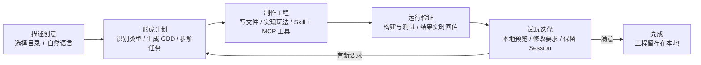
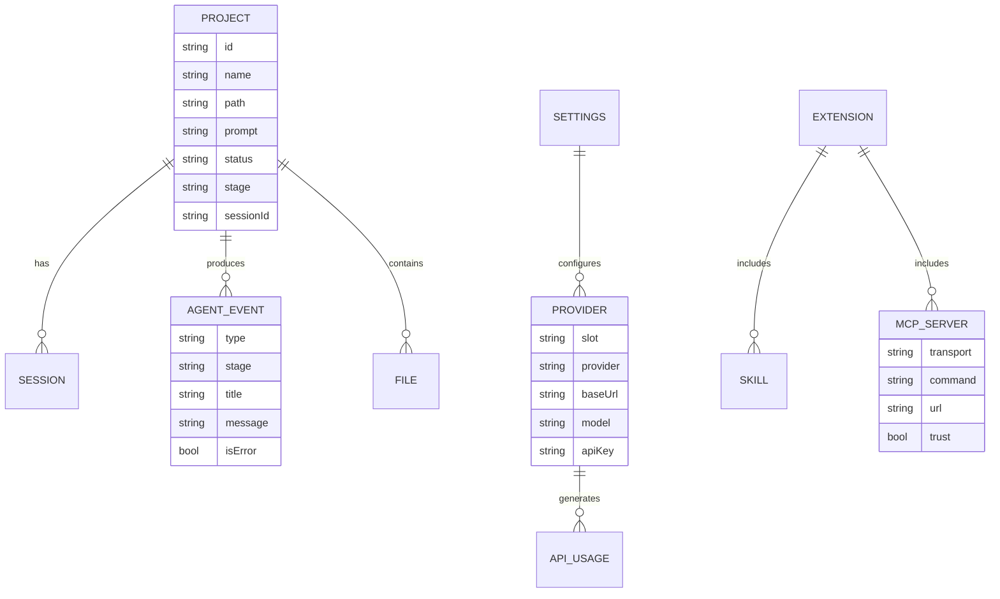

# Aether.ai（以太AI）产品需求文档（PRD）

---

## 文档头部（基础元信息）

| 项目     | 内容                                     |
| -------- | ---------------------------------------- |
| 文档名称 | 【Aether.ai】AI 游戏制作智能工作台 PRD   |
| 产品名称 | Aether.ai（以太AI）                      |
| 模块名称 | 桌面客户端全量功能（V0.2.x）             |
| 文档版本 | V1.0                                     |
| 创建人   | 产品团队                                 |
| 创建日期 | 2026-08-12                               |
| 最后更新 | 2026-08-12                               |
| 保密等级 | 内部公开                                 |
| 阅读对象 | 产品、前端、后端、测试、UI、运维、业务方 |

### 版本修订记录

| 修订时间   | 文档版本 | 修订人   | 修订类型 | 详细修订内容                                                                                   |
| ---------- | -------- | -------- | -------- | ---------------------------------------------------------------------------------------------- |
| 2026-08-12 | V1.0     | 产品团队 | 新增     | 1. 按通用 PRD 模版初始化全量文档 2. 覆盖工作台、Agent、插件、Provider、诊断、依赖、安全模块 |

---

# 1 需求分析

## 1.1 需求背景

**为什么做**：

- **行业现状**：AI 编程助手（Copilot、Cursor 等）已在通用软件开发中普及，但游戏开发领域仍缺少一个"看得见过程"的 AI 制作工具。市面工具多为纯对话式，无法直接读写工程文件、调用引擎工具、执行构建验证，也无法形成从创意到可玩版本的闭环。
- **用户痛点**：
  1. 独立开发者有创意，但缺少工程化落地能力（策划文档、素材组织、构建验证）。
  2. AI 助手"只说不做"：给出建议后仍需用户手动执行；工具调用过程是黑盒，出错无从排查。
  3. 模型、密钥、MCP、引擎依赖分散在多个配置文件与终端命令中，配置成本高。
  4. Agent 任务一旦中断（网络抖动、无输出、崩溃），从头再来，无法保留现场。
- **业务价值**：将"想法 → 首个可玩版本 → 持续迭代"的路径缩短为桌面端内的可视化流程，让创作者专注玩法设计，把工程执行交给可观察的 Agent。

## 1.2 目标用户分析

| 用户类型                 | 画像                                                           | 核心诉求                               |
| ------------------------ | -------------------------------------------------------------- | -------------------------------------- |
| 核心用户：独立游戏开发者 | 1-5 人小团队或个人；会用自然语言描述玩法；熟悉或不熟悉引擎均可 | 快速产出可玩原型；在可见工作区内迭代   |
| 核心用户：游戏策划       | 擅长玩法与文案设计，代码能力弱                                 | 把策划意图转译为可运行工程与 GDD       |
| 次要用户：技术美术       | 关注素材管线与引擎联动                                         | 通过 MCP 打通 Blender/Unity 等素材工具 |
| 次要用户：小型制作团队   | 有版本管理习惯，需要成本与用量可控                             | 任务过程透明、Token 可统计、工程可备份 |

## 1.3 业务场景分析

| 场景           | 使用时机               | 操作链路                                        | 典型诉求                         |
| -------------- | ---------------------- | ----------------------------------------------- | -------------------------------- |
| 创意验证       | 有游戏点子想快速验证   | 新建项目 → 描述创意 → Agent 制作 → 网页预览试玩 | 1 小时内看到可玩版本             |
| 素材与工具联动 | 需要在引擎中做具体操作 | 配置 MCP → Agent 调用引擎工具 → 查看回传结果    | 让 Agent 真正操作 Unity/Godot 等 |
| 断点续作       | 长时间制作任务中断     | 打开项目 → 恢复 Session → 继续迭代              | 不丢失已生成的工程与进度         |
| 成本与用量管理 | 月度预算敏感           | 查看 Token/延迟统计 → 调整 Provider 配置        | 控制 API 开销                    |

## 1.4 数据分析

- 产品处于早期迭代阶段，本机诊断数据（调用次数、延迟、Token）是当前主要分析来源。
- 通过"调用与成本诊断"模块累计 Provider 连接测速与主 Agent 用量，用于判断模型选型与成本趋势。
- 用户反馈渠道：GitHub Issues（问题反馈）、社区讨论。

## 1.5 历史功能分析（可选）

- 前置版本（Noobi.ai）已完成：项目/阶段模型、CLI Agent Runtime、内置 Phaser Web 游戏生产流程、MCP stdio/HTTP/SSE 接入、Windows 候选包。
- 优点：端到端链路已验证；单任务调度稳定。
- 短板：品牌与 UI 风格老旧；Agent 过程可视化不足；无插件目录；Token 统计粒度粗。

## 1.6 竞品分析（可选）

| 竞品                     | 优势                   | 不足                           | Aether.ai 差异化                              |
| ------------------------ | ---------------------- | ------------------------------ | --------------------------------------------- |
| Cursor / Copilot         | 代码补全与编辑体验成熟 | 不面向游戏工程、无引擎工具通道 | 游戏管线（GDD→素材→构建→预览）端到端          |
| Godot Copilot 等引擎插件 | 与引擎集成深           | 仅限单引擎、无多 Provider 管理 | 多引擎 MCP + 模型/素材/音频 Provider 统一配置 |
| Rosebud 等 AI 游戏平台   | 云端生成、上手快       | 黑盒、不可控、工程不可导出     | 本地工程可见可备份、过程事件流透明            |

---

# 2 产品目标 & 迭代范围

## 2.1 产品定位

Aether.ai 是**本地优先的 AI 游戏制作桌面工作台**：Agent 在用户选择的本机目录中规划、编码、调用工具并运行验证，用户在客户端中观察全过程。

- **承接**：项目生命周期管理、Agent 调度与观察、Skills/MCP 插件、模型与素材 Provider、依赖管理、用量诊断。
- **不承接**：云同步、多人协作、内置自动更新、商业成品一键生成、代码/素材授权的最终审查（仅提示用户自查）。

## 2.2 整体目标

- **定性目标**：
  1. 让 Agent 的制作过程在客户端全程可视化（阶段、工具调用、事件流）。
  2. 把模型、密钥、MCP、引擎依赖的配置收口到设置中心。
  3. 中断可恢复：项目文件与 Session 保留，可停止、恢复并继续迭代。
- **定量目标**（迭代期参考值）：
  - 首次配置 Provider 到成功启动首个 Agent 的时长 ≤ 5 分钟。
  - 单个 Phaser Web 项目从创意到可玩预览的成功率 ≥ 80%。
  - Agent 连续无输出保护：90 秒提示、4 分钟自动停止，恢复成功率 ≥ 95%。
  - Provider 连接测速成功率 ≥ 99%（配置正确前提下）。

## 2.3 本次迭代范围

### 2.3.1 本次实现（必选）

1. AI 游戏制作工作台：项目列表、Pipeline 阶段、事件流、文件浏览、Web 游戏预览。
2. 可观察 Agent：全局单一 Active Run、停止、会话恢复、崩溃隔离、无输出监控、脱敏 Function Calling 查看。
3. 插件中心：Skills 与 MCP 统一为插件能力；精选目录；本地导入与 GitHub 安装。
4. 模型与素材服务：main / reasoning / image / video / audio 五槽 Provider 配置与连接测速。
5. 调用与成本诊断：调用次数、延迟、Token 统计展示。
6. 开发者模式：项目 Prompt、Function Calling、单任务调度状态查看。
7. 依赖管理：检测并按白名单安装/更新 Node(npx)、uvx、Godot、Blender、Unity Hub。
8. 本地与安全：API Key / MCP Secret 使用操作系统安全存储。
9. 品牌与视觉：Aether.ai 暗色全息科幻风 UI（V1.0 品牌切换完成）。

### 2.3.2 本次暂不实现（排期/砍掉）

- 云同步与多人协作（技术栈本地优先，暂不引入账号体系）。
- 内置自动更新（安装新版以覆盖安装完成）。
- 后台并行多 Agent 集群（当前单任务顺序调度）。
- Windows on ARM / 32 位 Windows / 便携版 / Microsoft Store 版。
- 供应商账单级对账（Token 统计仅作本机诊断）。
- 素材请求逐项 Token 记录（当前仅覆盖连接测速与主 Agent 最终结果）。

## 2.4 依赖关系

- **运行时依赖**：Node.js ≥ 20（内置 Runtime）；Phaser 项目依赖 npm 安装。
- **外部引擎依赖**（可选）：Unity Hub/Editor、Godot、Unreal、Blender + 对应 MCP Server。
- **第三方服务**：用户自备的 OpenAI 兼容 / 通义 / 豆包 / ElevenLabs / MiniMax / Stability / Lyria / Mureka 等 Provider 的 API Key 与额度。
- **系统能力**：macOS Keychain / Windows DPAPI（secureStorage）。
- **构建依赖**：macOS 需 Apple 公证；Windows 正式版需 Authenticode 代码签名。

## 2.5 风险与应对方案

| 风险                                 | 类型   | 应对                                                                |
| ------------------------------------ | ------ | ------------------------------------------------------------------- |
| Agent 在用户目录写文件/执行命令      | 安全   | 权限模式（auto-edit / yolo）明示；建议 Git 备份；发布前强制自查提示 |
| 第三方 Skill/MCP 执行恶意代码        | 安全   | 插件信任控制：仅启用可信来源；MCP Server 需用户显式勾选 trust       |
| 模型无输出/长时间卡死                | 稳定性 | 90 秒等待提示 + 4 分钟自动停止，保留项目与 Session                  |
| API Key 泄露                         | 安全   | 渲染进程不直接读密钥；主进程解密后只交给本轮 Agent Runtime 独立通道 |
| 覆盖安装导致用户数据丢失             | 兼容   | 安装器保留应用数据；卸载不以用户项目目录为目标                      |
| 未签名 Windows 包被 SmartScreen 拦截 | 上线   | CI 上传 unsigned-dev 产物仅供内测；正式发布前完成签名验证           |

---

# 3 需求综述

## 3.1 名词解释

| 术语             | 释义                                                                                                                                                            |
| ---------------- | --------------------------------------------------------------------------------------------------------------------------------------------------------------- |
| Agent Runtime    | 随客户端分发的 CLI 子进程运行时，承载主 Agent 的模型循环与工具注册表                                                                                            |
| Active Run       | 当前全局唯一正在运行的 Agent 任务；同一时间只允许一个                                                                                                           |
| Pipeline Stage   | 制作阶段：brief（简述）、classify（分类）、scaffold（脚手架）、gdd（策划文档）、assets（素材）、tilemap（地图）、code（编码）、verify（验证）、complete（完成） |
| Session          | 单次 Agent 任务的持久化会话，可恢复继续                                                                                                                         |
| Skill            | Agent 按需加载的专业说明与工作方法（SKILL.md），不等同于已连接编辑器                                                                                            |
| MCP              | Model Context Protocol，实际工具通道（stdio / HTTP / SSE），连接外部引擎与工具                                                                                  |
| Provider Slot    | 模型/素材服务的五类槽位：main、reasoning、image、video、audio                                                                                                   |
| auto-edit / yolo | 权限模式：默认编辑确认 / 完全放行                                                                                                                               |
| GDD              | Game Design Document，游戏策划文档                                                                                                                              |
| 脱敏             | 事件持久化前对敏感信息（密钥等）做遮蔽处理                                                                                                                      |

## 3.2 整体设计思路

- **架构分层**：Electron Main（IPC 控制面）→ Agent Runner（CLI 子进程）→ 工具注册表（内置工具 / Skill / MCP / Task 子 Agent）。
- **单一活动任务**：桌面调度器一次只运行一个 Agent 任务；同一轮内 Function Call 顺序执行；Task 子 Agent 阻塞等待，不可递归委派。
- **事件驱动可视化**：Agent 全部输出以 NDJSON 事件流实时回传客户端，分类为 lifecycle / thought / text_delta / tool_call / tool_result / error / complete，并脱敏持久化。
- **本地与安全优先**：工程保存在用户选择的目录；敏感配置由主进程解密后通过独立通道只交给本轮 Agent Runtime。
- **插件双通道**：Skill（知识）与 MCP（工具）合并为插件中心；MCP 配置保存后在下一次 Agent 启动时连接发现，单 Server 失败不阻断其他 Server。

## 3.3 业务流程总图

## 3.4 实体关系（ER）

## 3.5 详细用户操作流程

**首次使用流程**：

1. 打开「设置 → API 管理」，配置主 Agent 的 Provider、Model、Base URL 与 API Key。
2. 点击「连接测试」验证可用性与延迟。
3. 新建项目：输入名称、选择本地目录、用自然语言描述创意（玩法、视角、主题、美术方向）。
4. 点击「启动 Agent」开始制作。
5. 观察 Pipeline 阶段推进、事件流与工具调用。
6. 完成后在「预览」中试玩，或在文件树中查看工程。

**断点续作流程**：

1. 项目列表选择状态为 stopped/failed 的项目。
2. 点击「恢复 Session」，Agent 从上次会话继续。
3. 保留原项目文件与 Prompt。

**插件接入流程**：

1. 打开「插件中心」：浏览精选目录，或从本地/GitHub 导入 Skill。
2. 配置 MCP Server（传输方式、命令/URL、环境变量 Secret）。
3. 勾选 trust 后启用；保存配置，下一次启动 Agent 时连接发现工具。

## 3.6 全量需求清单

| 功能模块 | 需求编号 | 优先级(P0/P1/P2) | 需求标题           | 简单概述                                  |
| -------- | -------- | ---------------- | ------------------ | ----------------------------------------- |
| 工作台   | F01      | P0               | 项目管理           | 新建/选择/删除项目，绑定本地目录          |
| 工作台   | F02      | P0               | Pipeline 阶段视图  | 展示 9 阶段制作进度                       |
| 工作台   | F03      | P0               | 事件流             | 实时展示 Agent 生命周期/思考/工具调用事件 |
| 工作台   | F04      | P0               | 文件浏览           | 项目目录树浏览与文件内容查看              |
| 工作台   | F05      | P0               | Web 游戏预览       | 内置预览 dist/index.html                  |
| Agent    | F06      | P0               | 单任务调度         | 全局唯一 Active Run，拒绝第二任务         |
| Agent    | F07      | P0               | 停止与会话恢复     | 可停止；保留文件与 Session；可恢复        |
| Agent    | F08      | P0               | 无输出保护         | 90 秒提示、4 分钟自动停止                 |
| Agent    | F09      | P1               | 脱敏调用查看       | 查看 Function Calling（脱敏）             |
| 插件     | F10      | P0               | Skill 管理         | 项目级/用户级 Skill 导入、移除、目录定位  |
| 插件     | F11      | P0               | MCP Server 管理    | stdio/HTTP/SSE 配置、Secret、trust        |
| 插件     | F12      | P1               | 精选插件目录       | 内置精选 Skill/MCP 列表                   |
| Provider | F13      | P0               | 五槽 Provider 配置 | main/reasoning/image/video/audio          |
| Provider | F14      | P0               | 连接测速           | 验证配置并返回状态/延迟                   |
| 诊断     | F15      | P1               | 调用与成本统计     | 调用次数、延迟、Token 汇总                |
| 开发者   | F16      | P1               | 开发者模式         | 查看 Prompt、Function Calling、调度状态   |
| 依赖     | F17      | P0               | 依赖检测与管理     | Node/npx、uvx、Godot、Blender、Unity Hub  |
| 安全     | F18      | P0               | 安全存储           | API Key/MCP Secret 走系统安全存储         |
| 品牌     | F19      | P1               | 品牌与视觉         | Aether.ai 暗色全息科幻风 UI               |

---

# 4 详细功能需求

## 4.1 【P0】项目管理（F01）

1. **功能概述**
   用户在客户端中创建、选择、管理游戏项目。每个项目绑定一个本地目录，Agent 的产出全部落入该目录。

2. **业务规则**
   - 项目名称必须为非空字符串，长度 ≤ 100 字符。
   - 项目目录通过系统目录选择器选择，不允许手写相对路径。
   - 项目状态流转：`draft → running → waiting / completed / failed / stopped`；`stopped`/`failed` 可再次启动或恢复。
   - 同一时间仅一个项目处于 `running`（受全局单任务调度约束）。
   - 项目记录持久化于本地状态库，删除项目**不删除**磁盘目录。

3. **分支逻辑**
   - 正常流程：新建 → 输入名称/目录/创意描述 → 保存 → 出现在项目列表。
   - 异常流程：名称为空 → 提示"项目名称必须是非空字符串"；目录不可写 → 提示权限错误；重复创建同名项目 → 允许（以 id 区分），但提示确认。

4. **页面/交互说明**
   - 左侧 ProjectRail 展示项目列表（图标 + 名称 + 状态点）。
   - 「新建项目」弹出 NewProjectDialog：名称输入框、目录选择按钮、创意描述多行文本域、取消/创建按钮。
   - 当前项目高亮，切换项目刷新工作台三栏（Pipeline / 事件流 / 文件树）。

5. **字段说明**

   | 字段     | 类型   | 必填 | 默认值     | 说明                       |
   | -------- | ------ | ---- | ---------- | -------------------------- |
   | 名称     | string | 是   | 空         | 项目显示名                 |
   | 目录     | path   | 是   | 默认工作区 | 系统选择器返回绝对路径     |
   | 创意描述 | string | 是   | 空         | 玩法、视角、主题、美术方向 |

6. **验收标准（测试依据）**
   - 名称为空时创建被拒绝并出现错误提示。
   - 创建成功后项目出现在列表，状态为 `draft`。
   - 删除项目后磁盘目录仍存在。
   - 重启客户端后项目列表完整恢复。

## 4.2 【P0】单任务调度与可观察 Agent（F06/F07/F08）

1. **功能概述**
   Agent Runner 管理全局唯一 Active Run；用户可启动、停止、恢复会话；客户端实时呈现事件流。

2. **业务规则**
   - 已有任务运行时，新任务被拒绝，返回 `accepted: false`；无后台等待队列。
   - 启动流程：加载项目、Provider、Skills 与 MCP 配置 → 启动独立 CLI 子进程 → 主 Agent 循环。
   - 停止：终止子进程，项目保留文件与 Session ID，状态置为 `stopped`。
   - 无输出保护：连续 90 秒无输出显示等待提示；连续 4 分钟无输出自动停止（可用 `GAMEAGENT_AGENT_IDLE_TIMEOUT_MS` 调整）。
   - MCP Server 发现可并行，单个 Server 失败不阻断其他 Server。

3. **分支逻辑**
   - 正常流程：启动 → 阶段推进 → 完成（`completed`）。
   - 异常流程：模型报错 → `failed`，可查看错误事件；无输出 → 超时停止；用户手动停止 → `stopped`；子进程崩溃 → 崩溃隔离，主界面不随之崩溃，可恢复。

4. **页面/交互说明**
   - Pipeline 组件：9 阶段横向或纵向展示，当前阶段高亮，完成阶段打勾。
   - EventStream 组件：按时间流展示事件卡片（思考/文本/工具调用/结果/错误），错误红色标记。
   - 顶部操作区：启动/停止按钮随状态切换；恢复按钮在 stopped/failed 状态出现。

5. **字段说明**

   | 字段     | 说明                                                                                                      |
   | -------- | --------------------------------------------------------------------------------------------------------- |
   | 事件类型 | user / lifecycle / thought / assistant / text_delta / tool_call / tool_result / stderr / error / complete |
   | 阶段     | brief / classify / scaffold / gdd / assets / tilemap / code / verify / complete                           |

6. **验收标准（测试依据）**
   - 运行中再次启动返回拒绝且界面给出提示。
   - 停止后项目文件保留，可恢复 Session 继续。
   - 90 秒无输出出现等待提示；4 分钟自动停止并保留 Session。
   - 单个 MCP Server 连接失败不影响其他 Server 与主任务。

## 4.3 【P0】模型与素材 Provider 配置（F13/F14）

1. **功能概述**
   在设置中心统一管理五槽 Provider（main、reasoning、image、video、audio），支持连接测速。

2. **业务规则**
   - 支持 Provider：openai-compat、tongyi、doubao、elevenlabs、minimax、stability、google-lyria、mureka。
   - API Key 保存至操作系统安全存储；渲染进程只能看到"已配置"状态，不可读回明文。
   - 主槽可被 reasoning 等槽位继承配置（`apiKeyInherited`）。
   - 连接测速返回 `success / warning / error` + 消息 + 延迟毫秒数。

3. **分支逻辑**
   - 正常流程：填写 Provider/Base URL/Model/API Key → 保存 → 连接测试 → 显示成功与延迟。
   - 异常流程：Key 错误 → error + 明确消息；网络超时 → error；部分字段缺失 → 校验提示。

4. **页面/交互说明**
   - SettingsDialog 的 API 管理页签：五槽 Tab 或分区卡片；每槽字段 + 「连接测试」按钮；测试结果内联展示状态图标与延迟。

5. **字段说明**

   | 字段     | 必填 | 说明                 |
   | -------- | ---- | -------------------- |
   | Provider | 是   | 下拉选择，枚举见 3.1 |
   | Base URL | 是   | OpenAI 兼容地址      |
   | Model    | 是   | 模型名               |
   | API Key  | 是   | 密文存储             |

6. **验收标准（测试依据）**
   - 保存后重启客户端，Key 状态仍为"已配置"。
   - 连接测试在 10 秒内返回状态与延迟。
   - 渲染进程无法通过 API 读取明文 Key。

## 4.4 【P0】插件中心：Skills 与 MCP（F10/F11）

1. **功能概述**
   Skills 与 MCP 统一为插件能力；支持精选目录、本地导入、GitHub 安装；MCP 配置保存后于下次 Agent 启动时连接。

2. **业务规则**
   - Skill 分级：project（项目级）、user（用户级）。
   - 安装 Skill 不等于已连接编辑器；MCP 才是工具通道。
   - MCP 传输：stdio（command + args + cwd）、http、sse（url）。
   - MCP Server 必须勾选 trust 才可启用；Secret（env/headers）走安全存储。
   - GitHub Skill 安装需合法 URL，可指定 ref 与 path。

3. **分支逻辑**
   - 正常流程：导入 Skill → 校验 SKILL.md → 显示在插件列表 → Agent 按需加载。
   - 异常流程：URL 非法 → 报错；SKILL.md 缺失 → 标记 invalid 并展示 error；重复导入 → 提示已存在。

4. **页面/交互说明**
   - ExtensionsDialog：左列 Skills / MCP 分区；Skill 卡片含名称、描述、级别、来源；MCP 卡片含传输方式、启用开关、trust 勾选。
   - 支持"在文件夹中显示"定位 Skill 目录。

5. **验收标准（测试依据）**
   - 本地导入项目级/用户级 Skill 后列表正确展示。
   - GitHub URL 安装成功且来源信息（repo/ref/path）记录正确。
   - MCP Server 保存后，下次启动 Agent 时完成连接发现，单 Server 失败不阻断整体。

## 4.5 【P0】依赖管理（F17）

1. **功能概述**
   检测并按白名单安装/更新/打开本机依赖：Node(npx)、uvx、Godot、Blender、Unity Hub（Unity Editor 由 Hub 管理）。

2. **业务规则**
   - 状态：installed / missing / unsupported。
   - 管理方式：homebrew（macOS）、winget（Windows）、unity-hub、manual。
   - 依赖管理只负责安装/更新/打开宿主软件，**不是** Agent 控制通道。

3. **分支逻辑**
   - 正常流程：检测 → 展示版本/路径 → 按需执行安装/更新/打开，输出流实时回传。
   - 异常流程：命令失败 → 返回 exitCode 与消息；超时 → timedOut 标记。

4. **验收标准（测试依据）**
   - 检测结果与实际环境一致（版本、路径）。
   - 安装/更新操作输出实时可见，失败有明确消息与退出码。
   - 未安装依赖不阻塞客户端其他功能。

## 4.6 【P1】调用与成本诊断 + 开发者模式（F15/F16）

1. **功能概述**
   展示主 Agent 调用次数、延迟与 Token 统计；开发者模式可查看项目 Prompt、Function Calling 与单任务调度状态。

2. **业务规则**
   - 统计范围：Provider 连接测试 + 主 Agent 最终结果；不等同供应商账单。
   - Token 字段：input / output / cacheRead / cacheWrite / total。
   - 开发者模式开关保存在设置中。

3. **验收标准（测试依据）**
   - 运行后用量快照含 totals、providers、recent 三部分。
   - 开发者模式下可查看脱敏后的 Function Calling 记录。
   - 统计数字与事件流记录一致。

---

# 5 非功能性需求

## 5.1 性能需求

- 客户端冷启动（打包版）首屏可交互 ≤ 3 秒（同机 SSD 基准）。
- Agent 事件从子进程产生到 UI 渲染延迟 ≤ 500ms。
- Provider 连接测速超时阈值 10 秒。
- 单项目文件树加载 ≤ 2 秒（500 文件以内）。
- 事件流持久化查询支持分页（hasMore）。

## 5.2 兼容性需求

- macOS Apple Silicon（正式版）；Windows 11 x64（未签名候选版）。
- 不支持：Windows on ARM、32 位 Windows、Linux、便携版、Microsoft Store 版。
- 系统版本：macOS 13+，Windows 11 x64。
- 内置预览要求项目存在 `dist/index.html`；引擎项目在对应编辑器中运行。

## 5.3 安全 & 权限需求

- API Key 与 MCP Secret 使用操作系统安全存储（macOS Keychain / Windows DPAPI）。
- 渲染进程无法直接读取密钥；敏感配置由主进程解密后通过独立通道只交给本轮 Agent Runtime。
- 权限模式：auto-edit（默认确认）/ yolo（完全放行），切换需显式操作。
- 第三方 Skill/MCP 必须显式 trust；安装前提示"可能执行代码、访问编辑器或接收凭据"。
- 事件持久化前做脱敏处理。
- 应用身份标识 `com.gameagent.desktop` 保持不变（凭据加密与升级兼容）。

## 5.4 可用性设计

- 空状态：无项目时展示引导（配置 API → 新建项目）。
- 加载状态：Agent 启动/连接测试/依赖操作均有进行中反馈。
- 失败状态：错误事件红色高亮，可查看详情；崩溃隔离提示"可恢复会话"。
- 无输出状态：90 秒等待提示 + 4 分钟自动停止文案说明。
- 危险操作（删除项目、卸载依赖）需二次确认。

## 5.5 前端埋点统计

| 事件标识               | 事件名称      | 事件描述        | 属性Key           | 属性描述         | 枚举值                                                                |
| ---------------------- | ------------- | --------------- | ----------------- | ---------------- | --------------------------------------------------------------------- |
| aether_project_created | 项目创建      | 新建项目成功    | projectId         | 项目ID           | -                                                                     |
| aether_agent_started   | Agent 启动    | 启动 Agent 任务 | projectId, resume | 项目ID, 是否恢复 | resume: true/false                                                    |
| aether_agent_stopped   | Agent 停止    | 手动/超时停止   | projectId, reason | 项目ID, 停止原因 | reason: manual/timeout/crash                                          |
| aether_provider_tested | Provider 测速 | 连接测试完成    | slot, status      | 槽位, 状态       | slot: main/reasoning/image/video/audio; status: success/warning/error |

## 5.6 后端业务指标统计

| 指标名称       | 统计维度  | 指标口径&计算规则                    | 异常数据剔除规则       | 可视化形式        |
| -------------- | --------- | ------------------------------------ | ---------------------- | ----------------- |
| 项目制作成功率 | 项目      | completed 数 / 启动数                | 手动停止不计入失败     | 卡片数字 + 趋势图 |
| Agent 平均时长 | 项目      | complete/failed 任务 durationMs 均值 | 超时任务单独标注       | 表格              |
| Token 消耗     | Provider  | totalTokens 求和                     | 连接测试与资产调用分列 | 柱状图            |
| 插件启用率     | Skill/MCP | 启用数 / 安装数                      | —                      | 列表              |

## 5.7 灰度发布策略

1. 灰度维度：GitHub Releases 渠道，先 macOS 后 Windows 候选版。
2. 灰度节奏：内部测试 → unsigned-dev CI 产物 → 签名后正式发布。
3. 灰度监控：Issue 反馈、安装成功率、启动崩溃率；出现致命回归时撤回发布。

## 5.8 日志&运维需求

- 主进程与 Agent 子进程日志分级输出（info/warn/error）。
- 事件流落盘（脱敏后）供会话恢复。
- 崩溃与无输出事件记录时间线，支持本地诊断。
- 打包冒烟：`--aether-smoke-test` 验证安全存储往返与打包产物（输出 `AETHER_PACKAGED_SMOKE_READY`）。

---

# 6 数据与接口规范

## 6.1 数据字典

| 数据表名   | 字段名      | 字段类型 | 长度 | 是否必填 | 默认值        | 字段释义         | 约束规则                                                        |
| ---------- | ----------- | -------- | ---- | -------- | ------------- | ---------------- | --------------------------------------------------------------- |
| project    | id          | string   | 64   | 是       | —             | 项目唯一标识     | UUID                                                            |
| project    | name        | string   | 100  | 是       | —             | 项目名           | 非空                                                            |
| project    | path        | string   | 1024 | 是       | —             | 本地目录绝对路径 | 系统选择器产出                                                  |
| project    | status      | enum     | —    | 是       | draft         | 状态             | draft/running/waiting/completed/failed/stopped                  |
| project    | stage       | enum     | —    | 是       | brief         | 阶段             | brief/classify/scaffold/gdd/assets/tilemap/code/verify/complete |
| project    | sessionId   | string   | 64   | 否       | —             | 会话ID           | 可恢复会话                                                      |
| provider   | slot        | enum     | —    | 是       | —             | 槽位             | main/reasoning/image/video/audio                                |
| provider   | provider    | enum     | —    | 是       | openai-compat | 供应商           | 见 3.1 枚举                                                     |
| provider   | apiKey      | secret   | —    | 否       | —             | 密钥             | 系统安全存储，不可明文读回                                      |
| mcp_server | transport   | enum     | —    | 是       | stdio         | 传输             | stdio/http/sse                                                  |
| mcp_server | trust       | bool     | —    | 是       | false         | 信任开关         | 未信任不可启用                                                  |
| api_usage  | totalTokens | number   | —    | 是       | 0             | Token 总量       | ≥ 0                                                             |

## 6.2 接口清单

| 接口名称               | 请求方式 | 接口地址                         | 入参说明                | 出参说明                           | 错误码&含义        | 调用时机          |
| ---------------------- | -------- | -------------------------------- | ----------------------- | ---------------------------------- | ------------------ | ----------------- |
| bootstrap              | IPC      | gameAgent.bootstrap              | —                       | 项目列表、设置、版本、Runtime 状态 | —                  | 渲染进程启动      |
| createProject          | IPC      | gameAgent.createProject          | name/directory/prompt   | ProjectRecord                      | 名称非空校验错误   | 新建项目          |
| startAgent             | IPC      | gameAgent.startAgent             | projectId/prompt/resume | { accepted }                       | 任务占用拒绝       | 启动 Agent        |
| stopAgent              | IPC      | gameAgent.stopAgent              | projectId               | —                                  | —                  | 停止 Agent        |
| testProviderConnection | IPC      | gameAgent.testProviderConnection | slot/endpoint           | { status, message, latencyMs }     | 连接失败详情       | 连接测速          |
| loadAgentHistory       | IPC      | gameAgent.loadAgentHistory       | projectId               | 事件列表 + hasMore                 | —                  | 打开项目/恢复会话 |
| loadExtensions         | IPC      | gameAgent.loadExtensions         | projectId?              | skills + mcpServers                | —                  | 打开插件中心      |
| installGitHubSkill     | IPC      | gameAgent.installGitHubSkill     | url/path/ref/level      | SkillSummary                       | URL 非法/校验失败  | GitHub 安装       |
| runDependencyAction    | IPC      | gameAgent.runDependencyAction    | id/action               | 结果/退出码/超时                   | 命令失败           | 依赖管理操作      |
| startPreview           | IPC      | gameAgent.startPreview           | projectId               | 预览 URL                           | 无 dist/index.html | 预览试玩          |

---

# 7 文案规范 & 附录

## 7.1 中英文对照表

| 来源位置 | 中文文案   | 英文文案        |
| -------- | ---------- | --------------- |
| 产品名   | 以太AI     | Aether.ai       |
| 项目列表 | 项目       | Projects        |
| 新建项目 | 新建项目   | New Project     |
| 启动按钮 | 启动 Agent | Start Agent     |
| 停止按钮 | 停止       | Stop            |
| 恢复按钮 | 恢复会话   | Resume Session  |
| 设置     | 设置       | Settings        |
| 插件中心 | 插件       | Plugins         |
| 依赖管理 | 依赖管理   | Dependencies    |
| 预览     | 预览       | Preview         |
| 连接测试 | 连接测试   | Test Connection |

## 7.2 全局文案规范

- 按钮：动词开头（新建、启动、停止、保存、安装）。
- 报错文案：说明问题 + 建议动作，如"项目名称 必须是非空字符串。"。
- 安全提示：以"只应安装和启用可信来源……"句式给出边界提醒。
- 统一术语：Agent、Provider、Skill、MCP、Session、Pipeline 不翻译。

## 7.3 原型&参考附件

- 原型与 UI 稿：`packages/desktop/src/renderer/`（React 组件即高保真实现）。
- 流程图：`docs/images/aether-ai-workflow.png`（从想法到可玩版本）。
- 架构文档：`docs/gameagent/ARCHITECTURE.md`。
- 桌面使用说明：`docs/gameagent/DESKTOP_GUIDE.md`。
- API 配置：`docs/gameagent/API_CONFIGURATION.md`。

---

# 8 评审与落地闭环

1. 评审前阅读确认：□ 已阅读文档

2. 正式评审结论：□ 评审通过 □ 待修改后复审 □ 需求驳回

3. 评审意见记录：

> 逐条记录参会人意见、修改方案、完成时限
